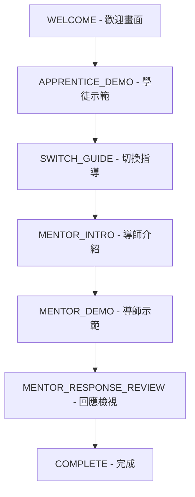

# Tutorial 模組 - CLAUDE.md

此模組提供 Dear My Friend 應用程式的互動式教學系統，引導新使用者了解學徒-導師視角切換的核心概念。

## 模組概述

Tutorial 模組是一個完整的引導式教學系統，通過多個步驟的互動式覆蓋層，幫助使用者理解應用程式的核心功能。教學系統獨立於正常對話流程運行，使用專用的狀態管理和訊息存儲，確保不會干擾正常操作。

### 核心功能
- **分步式教學流程**：7個漸進式教學步驟
- **互動式示範**：實際展示學徒和導師視角的訊息範例
- **狀態持久化**：記住使用者是否已完成教學
- **可跳過設計**：允許有經驗的使用者直接跳過
- **視覺化進度**：顯示當前步驟和整體進度

## 主要元件說明

### TutorialOverlay
**檔案位置**: `/src/features/tutorial/components/tutorial-overlay.tsx`

教學系統的核心 UI 元件，提供模態式覆蓋層介面。

#### Props 介面
```typescript
type TutorialOverlayProps = {
  isVisible: boolean;                // 覆蓋層可見性
  currentStep: TutorialStep;         // 當前教學步驟
  stepTitle: string;                 // 步驟標題
  onNext: () => void;               // 進入下一步的回調
  onSkip: () => void;               // 跳過教學的回調
  isTransitioning: boolean;         // 是否處於步驟轉換中
  getDemoMessage?: (role: 'apprentice' | 'mentor') => string;
};
```

#### 主要功能
1. **步驟內容渲染**: 根據 `currentStep` 動態顯示對應的教學內容
2. **進度視覺化**: 使用進度條顯示教學完成度
3. **互動式圖示**: 每個步驟配有對應的 Lucide 圖示
4. **響應式佈局**: 適配桌面和行動裝置
5. **按鈕狀態管理**: 根據步驟和轉換狀態動態調整按鈕文字

#### 內部函數
- `getStepIcon()`: 根據當前步驟返回對應圖示
- `getStepContent()`: 渲染步驟特定的教學內容
- `getButtonText()`: 動態生成主要操作按鈕的文字

## 資料流程

### 教學步驟流程


### 狀態管理流程
1. **初始化**: `tutorial-store.ts` 檢查是否需要自動開始教學
2. **步驟進展**: 使用者點擊「下一步」觸發 `nextStep()`
3. **狀態同步**: 通過 `use-app-state.ts` 協調教學模式和對話系統
4. **持久化**: 完成或跳過時將狀態存儲到 `localStorage`

### 訊息系統整合
- 教學模式使用獨立的 `tutorialMessages` 陣列
- 示範訊息通過 `TUTORIAL.DEMO_MESSAGES` 常數提供
- 教學結束後自動切換回正常對話模式

## 使用方式

### 基本使用
```typescript
import { TutorialOverlay } from '@/features/tutorial';
import { useAppState } from '@/store/use-app-state';

function App() {
  const {
    tutorialState,
    getCurrentStepTitle,
    nextTutorialStep,
    skipTutorial,
    getDemoMessage
  } = useAppState();

  return (
    <TutorialOverlay
      isVisible={tutorialState.isOverlayVisible}
      currentStep={tutorialState.currentStep}
      stepTitle={getCurrentStepTitle()}
      onNext={nextTutorialStep}
      onSkip={skipTutorial}
      isTransitioning={tutorialState.isStepTransitioning}
      getDemoMessage={getDemoMessage}
    />
  );
}
```

### 程式化控制
```typescript
// 手動開始教學
startTutorial();

// 檢查教學狀態
if (shouldAutoStartTutorial()) {
  startTutorial();
}

// 跳過教學並標記為已完成
skipTutorial();

// 僅暫停教學（不標記為已完成）
pauseTutorial();
```

## 元件間關係

### 依賴關係圖
```
TutorialOverlay
├── @/types (TutorialStep, TUTORIAL_STEP)
├── @/components/ui/* (shadcn UI 元件)
├── lucide-react (圖示庫)
└── 父元件傳入的回調函數
```

### Store 整合
- **TutorialStore**: 教學狀態和步驟管理
- **ConversationStore**: 教學訊息存儲和模式切換
- **ViewModeStore**: 視角切換協調
- **UIStore**: 覆蓋層顯示狀態

### 跨模組通信
```typescript
// 教學模式啟動時的系統協調
useEffect(() => {
  if (tutorialState.isActive && !isTutorialMode) {
    resetToApprentice();        // 重置到學徒視角
    switchToTutorialMode();     // 切換到教學模式
  }
}, [tutorialState.isActive]);
```

## 重要函數和介面

### TutorialStore 核心方法

#### `startTutorial()`
初始化教學流程，設定初始狀態並顯示覆蓋層。

#### `nextStep()`
推進到下一個教學步驟，包含轉換狀態管理和步驟驗證。

#### `skipTutorial()` vs `pauseTutorial()`
- `skipTutorial()`: 跳過教學並在 localStorage 中標記為已完成
- `pauseTutorial()`: 僅關閉教學，不標記為已完成（下次啟動時仍會顯示）

#### `getCurrentStepTitle()`
根據當前步驟返回本地化的標題文字。

#### `getDemoMessage(role)`
獲取示範用的學徒或導師訊息內容。

### 常數定義

#### TUTORIAL_STEP 列舉
```typescript
export const TUTORIAL_STEP = {
  WELCOME: 0,                    // 歡迎畫面
  APPRENTICE_DEMO: 1,           // 學徒示範
  SWITCH_GUIDE: 2,              // 切換指導
  MENTOR_INTRO: 3,              // 導師介紹
  MENTOR_DEMO: 4,               // 導師示範
  MENTOR_RESPONSE_REVIEW: 5,    // 回應檢視
  COMPLETE: 6,                  // 完成
} as const;
```

#### Storage Keys
```typescript
STORAGE_KEYS.TUTORIAL_COMPLETED = 'dear-my-friend-tutorial-completed'
STORAGE_KEYS.TUTORIAL_CONVERSATION = 'dear-my-friend-tutorial-conversation'
```

### 教學內容配置

所有教學相關的文字內容和示範訊息都集中在 `/src/constants/index.ts` 的 `TUTORIAL` 常數中，便於維護和國際化。

#### 示範訊息
- **學徒訊息**: 展示如何表達困惑和問題
- **導師訊息**: 示範同理心回應和建設性建議

#### 步驟標題
每個教學步驟都有對應的標題，通過 `TUTORIAL.STEP_TITLES` 配置。

## 技術特點

### 使用者體驗設計
1. **漸進式揭露**: 每個步驟只呈現必要資訊，避免認知負荷
2. **視覺引導**: 使用圖示、顏色和版面設計引導注意力
3. **互動回饋**: 提供明確的進度指示和狀態回饋
4. **逃脫路徑**: 隨時可以跳過，尊重使用者選擇

### 效能最佳化
1. **條件渲染**: 只在需要時渲染覆蓋層元件
2. **狀態本地化**: 教學狀態獨立管理，避免影響主應用效能
3. **延遲載入**: 示範內容按需生成，減少初始載入時間

### 可維護性
1. **模組化設計**: 教學邏輯完全封裝，易於測試和維護
2. **配置驅動**: 內容和行為通過常數配置，易於修改
3. **型別安全**: 完整的 TypeScript 型別定義確保程式碼品質

## 注意事項

### 開發時注意
1. 修改教學步驟時需同步更新 `TUTORIAL_STEP` 和相關內容
2. 新增教學內容時建議先在常數檔案中定義文字
3. 教學系統與主應用邏輯有複雜的狀態依賴，修改時需謹慎測試

### 使用限制
1. 教學系統假設使用者按順序完成步驟，不支援任意跳躍
2. 教學模式下某些功能（如會話管理）可能受限
3. 瀏覽器 localStorage 不可用時教學狀態無法持久化

### 未來擴展
- 支援多語言教學內容
- 添加教學完成度分析
- 支援自定義教學流程
- 添加互動式提示系統