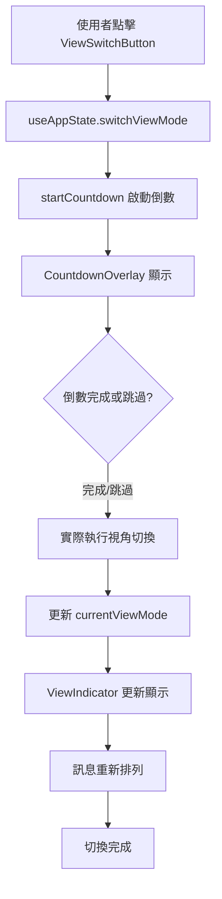

# View-Switch 模組 CLAUDE.md

此檔案詳細說明 `view-switch` 模組的功能、架構和使用方式。

## 模組概述

`view-switch` 模組負責處理「Dear My Friend」應用程式中的視角切換功能，是整個系統的核心機制之一。它提供了學徒視角與導師視角之間的無縫切換體驗，並包含倒數動畫、視覺指示器等使用者介面元件。

### 核心價值
- **視角轉換**：幫助使用者在「學徒」和「導師」兩個思維模式間切換
- **心理準備**：通過 10 秒倒數給予使用者心理調適時間
- **視覺回饋**：清楚展示當前視角狀態和切換進度

## 主要元件說明

### 1. ViewSwitchButton 元件

**檔案位置**: `/src/features/view-switch/components/view-switch-button.tsx`

**功能描述**: 視角切換觸發按鈕，提供直觀的切換介面。

**核心特性**:
- 動態按鈕文字：根據當前視角顯示對應的切換文字
- 載入狀態：切換過程中顯示旋轉動畫
- 脈衝效果：可選的視覺強調效果
- 響應式設計：適配不同螢幕尺寸

**Props 介面**:
```typescript
type ViewSwitchButtonProps = {
  currentViewMode: ViewMode;        // 當前視角模式
  onSwitch: () => void;            // 切換回調函數
  disabled?: boolean;              // 是否禁用
  isTransitioning?: boolean;       // 是否正在切換中
  className?: string;              // 自定義樣式
  shouldPulse?: boolean;           // 是否顯示脈衝效果
};
```

**視覺狀態**:
- 學徒視角：顯示「切換至導師視角」
- 導師視角：顯示「切換至學徒視角」
- 切換中：圖示旋轉動畫，按鈕禁用
- 脈衝模式：特殊強調效果

### 2. CountdownOverlay 元件

**檔案位置**: `/src/features/view-switch/components/countdown-overlay.tsx`

**功能描述**: 視角切換時的全螢幕倒數覆蓋層，提供心理準備時間。

**核心特性**:
- 10 秒倒數計時器，帶有圓形進度視覺化
- 全螢幕模糊背景，聚焦使用者注意力
- 可跳過功能，支援點擊按鈕或空格鍵
- 動態說明文字，解釋目標視角的心態

**Props 介面**:
```typescript
type CountdownOverlayProps = {
  isActive: boolean;            // 是否顯示覆蓋層
  remainingTime: number;        // 剩餘時間（毫秒）
  targetViewMode: ViewMode;     // 目標視角模式
  onSkip: () => void;          // 跳過回調函數
  className?: string;          // 自定義樣式
};
```

**UI 結構**:
- **倒數圓圈**: 視覺化倒數進度，數字顯示剩餘秒數
- **轉換說明**: 動態文字解釋當前切換狀態
- **視角描述**: 幫助使用者理解目標視角的心態
- **跳過按鈕**: 提供快速跳過選項
- **鍵盤提示**: 說明空格鍵快捷操作

**倒數邏輯**:
- 總時長：10 秒（COUNTDOWN.DURATION）
- 更新頻率：每 100ms（COUNTDOWN.TICK_INTERVAL）
- 進度計算：`((總時長 - 剩餘時間) / 總時長) * 100`

### 3. ViewIndicator 元件

**檔案位置**: `/src/features/view-switch/components/view-indicator.tsx`

**功能描述**: 當前視角的視覺指示器，持續顯示使用者所處的思維模式。

**核心特性**:
- 視覺化當前視角狀態
- 圖示和文字雙重指示
- 視角說明文字
- 響應式佈局適配

**Props 介面**:
```typescript
type ViewIndicatorProps = {
  currentViewMode: ViewMode;    // 當前視角模式
  className?: string;          // 自定義樣式
};
```

**視角映射**:
```typescript
學徒視角 (APPRENTICE):
- 圖示: User (使用者圖示)
- 標籤: "當前：學徒視角"
- 說明: "以學習者的心態提出問題和困惑"

導師視角 (MENTOR):
- 圖示: GraduationCap (學士帽圖示)
- 標籤: "當前：導師視角"  
- 說明: "以第三者角度提供客觀的建議和指導"
```

## 資料流程

### 視角切換完整流程



### 狀態管理整合

**涉及的 Store**:
1. **ViewModeStore**: 管理當前視角狀態
2. **CountdownStore**: 處理倒數計時邏輯
3. **ConversationStore**: 根據視角重新排列訊息

**狀態同步**:
```typescript
// useAppState 統一協調
const {
  currentViewMode,           // 來自 ViewModeStore
  isTransitioning,          // 來自 ViewModeStore
  countdownActive,          // 來自 CountdownStore
  remainingTime,            // 來自 CountdownStore
  switchViewMode,           // 整合多個 store 的操作
} = useAppState();
```

## 使用方式

### 基本使用

```typescript
import { ViewSwitchButton, CountdownOverlay, ViewIndicator } from '@/features/view-switch';
import { useAppState } from '@/store/use-app-state';

function MyComponent() {
  const {
    currentViewMode,
    isTransitioning,
    countdownActive,
    remainingTime,
    switchViewMode,
    skipCountdown,
  } = useAppState();

  return (
    <div>
      {/* 視角指示器 */}
      <ViewIndicator currentViewMode={currentViewMode} />
      
      {/* 切換按鈕 */}
      <ViewSwitchButton
        currentViewMode={currentViewMode}
        onSwitch={switchViewMode}
        isTransitioning={isTransitioning}
      />
      
      {/* 倒數覆蓋層 */}
      <CountdownOverlay
        isActive={countdownActive}
        remainingTime={remainingTime}
        targetViewMode={getTargetViewMode()}
        onSkip={skipCountdown}
      />
    </div>
  );
}
```

### 高級使用場景

**教學模式整合**:
```typescript
// 在教學模式中可以設定特殊的視覺提示
<ViewSwitchButton
  currentViewMode={currentViewMode}
  onSwitch={switchViewMode}
  shouldPulse={isTutorialStep(TUTORIAL_STEP.SWITCH_GUIDE)}
/>
```

**自定義樣式**:
```typescript
<ViewIndicator
  currentViewMode={currentViewMode}
  className="fixed top-4 right-4 z-40"
/>
```

## 元件間關係

### 協作模式

```
ChatInterface (主控制器)
├── ViewIndicator (持續顯示)
├── ViewSwitchButton (觸發器)
└── CountdownOverlay (轉場效果)
    ├── 監聽鍵盤事件 (Space 鍵跳過)
    ├── 視覺化倒數進度
    └── 提供跳過功能
```

### 事件流

1. **初始化**: ViewIndicator 顯示預設的學徒視角
2. **觸發切換**: ViewSwitchButton 被點擊
3. **開始倒數**: CountdownOverlay 覆蓋全螢幕
4. **倒數進行**: 圓形進度條和數字同步更新
5. **完成切換**: 
   - 自然倒數完成
   - 或使用者主動跳過（按鈕/空格鍵）
6. **狀態更新**: ViewIndicator 反映新的視角狀態
7. **訊息重排**: 對話介面根據新視角調整佈局

### 依賴關係

**外部依賴**:
- `@/types`: ViewMode 類型定義
- `@/constants`: UI 文字和倒數設定
- `@/store/use-app-state`: 統一狀態管理
- `@/components/ui/*`: shadcn UI 元件
- `lucide-react`: 圖示庫

**模組內部依賴**:
- 所有元件都依賴 ViewMode 類型
- CountdownOverlay 依賴 COUNTDOWN 常數
- 所有元件使用統一的 UI_TEXT 常數

## 重要函數和介面

### 核心類型定義

```typescript
// 視角模式
export const VIEW_MODE = {
  APPRENTICE: 'apprentice',  // 學徒視角
  MENTOR: 'mentor',          // 導師視角
} as const;

export type ViewMode = typeof VIEW_MODE[keyof typeof VIEW_MODE];
```

### 關鍵常數

```typescript
// 倒數計時設定
export const COUNTDOWN = {
  DURATION: 10,         // 10秒倒數
  TICK_INTERVAL: 100,   // 每100ms更新一次
} as const;

// UI 文字
export const UI_TEXT = {
  SWITCH_TO_MENTOR: '切換至導師視角',
  SWITCH_TO_APPRENTICE: '切換至學徒視角',
  SKIP_COUNTDOWN: '跳過',
  // ...
} as const;
```

### 核心邏輯函數

**ViewSwitchButton 關鍵邏輯**:
```typescript
const getButtonText = () => {
  return currentViewMode === VIEW_MODE.APPRENTICE
    ? UI_TEXT.SWITCH_TO_MENTOR
    : UI_TEXT.SWITCH_TO_APPRENTICE;
};
```

**CountdownOverlay 關鍵邏輯**:
```typescript
// 進度計算
const progress = ((COUNTDOWN.DURATION - remainingTime) / COUNTDOWN.DURATION) * 100;

// 秒數顯示
const seconds = Math.ceil(remainingTime);

// 視角說明文字
const getViewModeDescription = () => {
  if (targetViewMode === VIEW_MODE.MENTOR) {
    return '準備以第三者的角度，客觀地分析問題並提供建議';
  } else {
    return '準備以學習者的心態，接受指導並進一步思考';
  }
};
```

**ViewIndicator 關鍵邏輯**:
```typescript
const getViewInfo = () => {
  if (currentViewMode === VIEW_MODE.APPRENTICE) {
    return {
      label: UI_TEXT.APPRENTICE_LABEL,
      description: '以學習者的心態提出問題和困惑',
      icon: <User className="h-4 w-4" />,
      // ...
    };
  } else {
    return {
      label: UI_TEXT.MENTOR_LABEL,
      description: '以第三者角度提供客觀的建議和指導',
      icon: <GraduationCap className="h-4 w-4" />,
      // ...
    };
  }
};
```

## 設計考量

### 使用者體驗

1. **心理準備時間**: 10 秒倒數提供充分的思維轉換時間
2. **可跳過設計**: 有經驗的使用者可以快速跳過
3. **視覺回饋**: 清楚的進度指示和狀態提示
4. **鍵盤友善**: 支援空格鍵快捷操作

### 技術架構

1. **模組化設計**: 每個元件職責單一，易於測試和維護
2. **狀態集中管理**: 通過 useAppState 統一協調
3. **響應式設計**: 適配各種裝置尺寸
4. **可擴充性**: 元件支援自定義樣式和行為

### 效能最佳化

1. **條件渲染**: CountdownOverlay 只在需要時渲染
2. **事件處理最佳化**: 動態添加/移除鍵盤監聽器
3. **動畫效能**: 使用 CSS 動畫而非 JavaScript 動畫
4. **記憶化**: 適當使用 useMemo 和 useCallback

## 總結

`view-switch` 模組是「Dear My Friend」應用程式的關鍵功能，它不僅提供了技術上的視角切換能力，更重要的是通過精心設計的使用者介面，幫助使用者在不同的思維模式間進行有意識的轉換。模組的設計充分考慮了心理學原理（倒數緩衝時間）和使用者體驗（清楚的視覺指示、可跳過的彈性），是整個應用程式使用者體驗的重要基石。